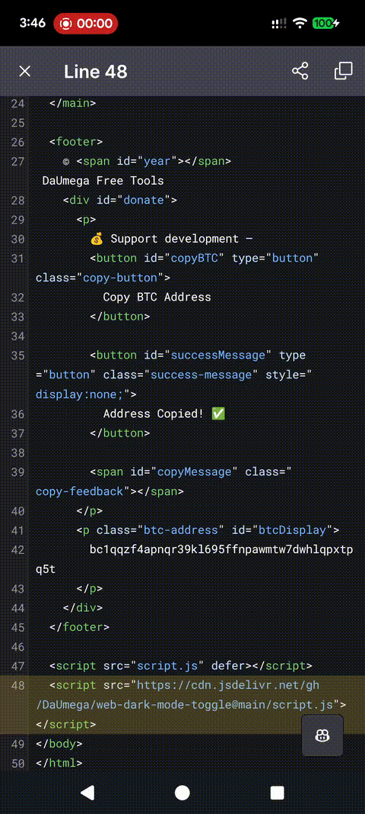

# Universal Dark Mode Toggle

A lightweight, standalone **dark mode toggle** for *any* website.  
Use it as:

- ✔️ a **Chrome Extension** (recommended for personal browsing)  
- ✔️ a **drop-in `<script>` snippet** for your own sites  

No dependencies. No external frameworks. Works almost everywhere.

---

## 🚀 Chrome Extension (Now Available!)

If you just want dark mode on every site you visit, install the published extension:

👉 **[Universal Dark Mode Toggle – Chrome Web Store](https://chrome.google.com/webstore/detail/ipoommhlcieajoipnlohbgemhpnemfcd)**  

- Instant universal dark mode  
- Works on most websites automatically  
- Toggle directly from Chrome toolbar  
- Lightweight & privacy-friendly (no data collection)

---

## 📦 Script Version (For Websites)

Include directly in your page:

```html
<!-- Optional configuration (position default: bottom-right) -->
<script>window.UNIVERSAL_DARK_MODE_OPTIONS = { position: 'top-right' };</script>

<!-- Required script inclusion -->
<script src="https://cdn.jsdelivr.net/gh/DaUmega/web-dark-mode-toggle@main/script.js"></script>
```

## Features
- Zero dependencies, single lightweight JS file.  
- Runtime toggle with persistent `localStorage` state.
- Toggle button in 9 positions.  
- Randomized CSS variable suffixes to avoid naming collisions.
- Lightweight CSS with safe DOM handling.  

## Runtime API
```js
UNIVERSAL_DARK_MODE.enable();
UNIVERSAL_DARK_MODE.disable();
UNIVERSAL_DARK_MODE.toggle();
UNIVERSAL_DARK_MODE.isEnabled();
UNIVERSAL_DARK_MODE.setPosition(p);
```

## Demo


## License
MIT
